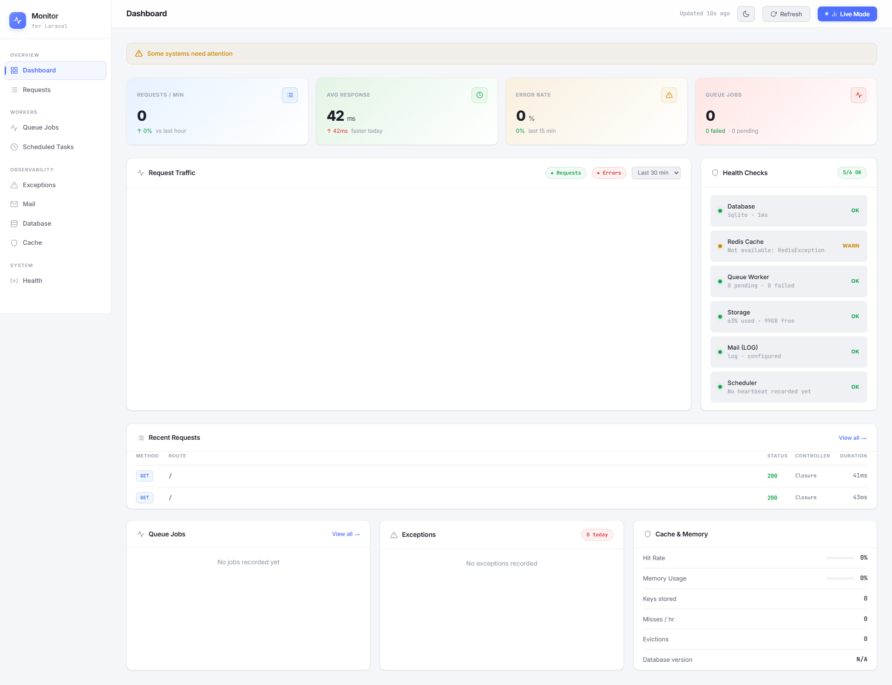

# Larawatch

<div align="center">

[](https://packagist.org/packages/sahlowle/larawatch)
[](https://php.net)
[](https://laravel.com)
[](https://livewire.laravel.com)
[](LICENSE.md)

### A beautiful, self-hosted Laravel application monitoring dashboard

Track HTTP requests, exceptions, queue jobs, health checks, cache stats, mail, and scheduled tasks — **all without any external service.**

</div>

---

## ✨ Features

| Module | What it tracks |
|---|---|
| 🌐 **Requests** | Every HTTP request — method, path, status, duration, IP |
| 💥 **Exceptions** | PHP exceptions grouped by hash, with full stack traces |
| ⚙️ **Queue Jobs** | Job processing, completion, and failures |
| ❤️ **Health Checks** | Database, Redis, Queue, Storage, Mail, Scheduler |
| 🗄️ **Cache** | Hit rate, memory usage, key count (Redis) |
| 📧 **Mail** | Sent and failed emails with recipients and size |
| 🕐 **Scheduled Tasks** | Task start, finish, skip, and failure events |

---

## 📋 Requirements

- PHP **8.2+**
- Laravel **11.x / 12.x**
- [Livewire](https://livewire.laravel.com/) **4.x**

---

## 🚀 Installation

### 1. Install via Composer

```bash
composer require sahlowle/larawatch
```

### 2. Publish the config file

```bash
php artisan vendor:publish --tag="larawatch-config"
```

### 3. Run the migrations

```bash
php artisan migrate
```

### 4. Record exceptions

Add the following to your `bootstrap/app.php`:

```php
->withExceptions(function (Exceptions $exceptions): void {
    $exceptions->reportable(function (\Throwable $e) {
        if (config('larawatch.enabled') && config('larawatch.features.exceptions', true)) {
            try {
                app(\Sahlowle\Larawatch\Services\ExceptionMonitorService::class)->record($e);
            } catch (\Throwable $ignored) {
                // Never let monitoring break the app
            }
        }
    });
})
```

> ✅ That's it! Visit `/monitor` to see your dashboard.

---

## ⚙️ Configuration

After publishing, edit `config/larawatch.php`:

```php
return [
    // Enable/disable the entire monitor
    'enabled' => env('MONITOR_ENABLED', true),

    // Dashboard theme: "dark" or "light"
    'theme' => env('MONITOR_THEME', 'light'),

    // URL prefix for the dashboard (default: /monitor)
    'path' => env('MONITOR_PATH', 'monitor'),

    // Restrict access by email or role
    'allowed_emails' => ['admin@example.com'],
    'allowed_roles'  => ['admin'],

    // Toggle individual modules
    'features' => [
        'requests'        => true,
        'exceptions'      => true,
        'jobs'            => true,
        'health'          => true,
        'cache'           => true,
        'mail'            => true,
        'scheduled_tasks' => true,
    ],

    // How long to keep data
    'data_retention' => [
        'requests'        => ['keep_hours' => 1],
        'exceptions'      => ['keep_days'  => 30],
        'jobs'            => ['keep_days'  => 7],
        'health_checks'   => ['keep_days'  => 7],
        'cache_stats'     => ['keep_days'  => 7],
        'mails'           => ['keep_days'  => 30],
        'scheduled_tasks' => ['keep_days'  => 14],
    ],
];
```

### Environment Variables

| Variable | Default | Description |
|---|---|---|
| `MONITOR_ENABLED` | `true` | Enable or disable the entire package |
| `MONITOR_THEME` | `light` | Dashboard theme (`dark` / `light`) |
| `MONITOR_PATH` | `monitor` | URL prefix for the dashboard |
| `MONITOR_DB_CONNECTION` | `null` | Separate DB connection for monitor tables |
| `MONITOR_TABLE_PREFIX` | `monitor_` | Prefix for all monitor database tables |

---

## 🔐 Authorization

In **local** environments, all authenticated users can access the dashboard.

In other environments, access is controlled by `allowed_emails` and `allowed_roles` in the config. You can also override the `viewMonitor` gate entirely in your `AppServiceProvider`:

```php
Gate::define('viewMonitor', function ($user) {
    return $user->is_admin;
});
```

---

## 🗑️ Pruning Old Data

The package provides the `larawatch:prune` command to clean up old records. Add it to your `routes/console.php` scheduler:

```php
// Prune all types according to their configured retention
Schedule::command('larawatch:prune --force')->daily();

// Or prune a specific type
Schedule::command('larawatch:prune --type=requests --force')->hourly();
```

**Available types:** `requests`, `exceptions`, `jobs`, `health_checks`, `cache_stats`, `mails`, `scheduled_tasks`

---

## 🗺️ Dashboard Routes

| URL | Description |
|---|---|
| `/monitor` | Main dashboard |
| `/monitor/requests` | HTTP request log |
| `/monitor/exceptions` | Exception tracker |
| `/monitor/jobs` | Queue job history |
| `/monitor/health` | Health checks |
| `/monitor/cache` | Cache & memory stats |
| `/monitor/mail` | Mail monitor |
| `/monitor/scheduled-tasks` | Scheduled task history |
| `/monitor/api/chart-data` | JSON chart data endpoint |

---

## 📦 Publishing Assets

```bash
# Config only
php artisan vendor:publish --tag="larawatch-config"

# Migrations only
php artisan vendor:publish --tag="larawatch-migrations"

# Views (to customize the dashboard UI)
php artisan vendor:publish --tag="larawatch-views"
```

---

## 🛠️ Local Development

If you are working on this package inside a host Laravel app using a path repository:

```json
// root composer.json
"repositories": [
    { "type": "path", "url": "./packages/sahlowle/larawatch" }
],
"require": {
    "sahlowle/larawatch": "*"
},
"minimum-stability": "dev",
"prefer-stable": true
```

Then run:

```bash
composer update sahlowle/larawatch
```

# Screenshot


---

## 📄 License

The MIT License (MIT). See [LICENSE](LICENSE.md) for details.